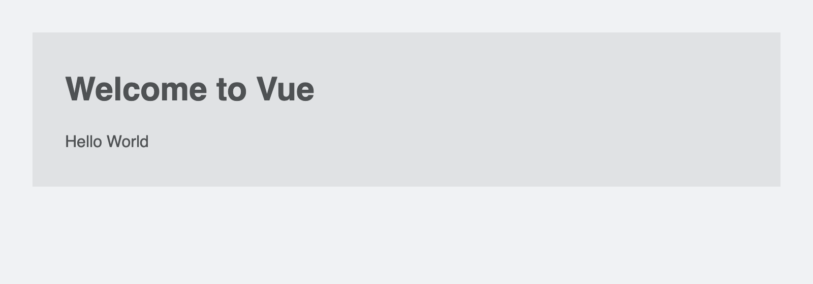

# Hello 1

Simple 'Hello World' with a Vue 2 CDN.

> Note: The latest Vue 2 version used here is 2.6.14.


## Steps to re-create

### 1. Add a Vue 2 CDN in HTML

```
<script src="https://cdn.jsdelivr.net/npm/vue@2.6.14"></script>
```


### 2. Add an element with id="app"

```
<div id="app">
  ...
</div>
```


### 3. Add a script to initialize Vue 2 app

```
<script>
  const app = new Vue({
    el: '#app',
    data: {
      hello: 'Hello World',
    },
  });
</script>
```


### 4. Display Vue 2 data within the element with id="app"

```
<div id="app">
  <h1 class="title">Welcome to Vue</h1>
  {{ hello }}
</div>
```
